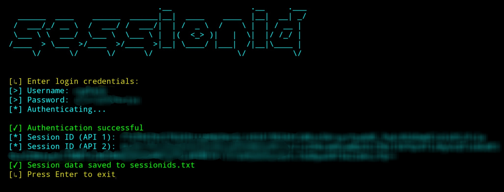
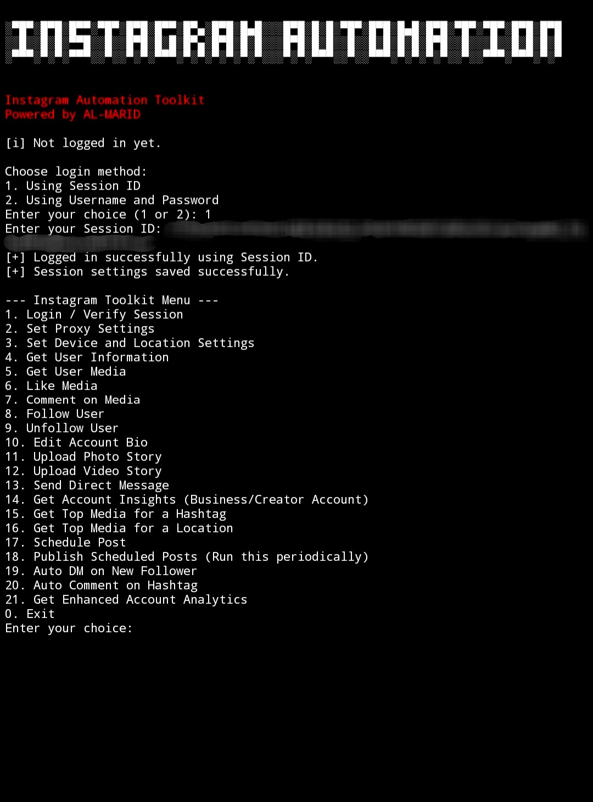

# Instagram Automation Toolkit

This repository contains a powerful and versatile Python-based toolkit designed for automating various tasks on Instagram. Leveraging the `instagrapi` library, this tool provides a command-line interface for managing your Instagram account, from basic interactions like liking and commenting to advanced features such as scheduling posts and retrieving account insights. It aims to simplify and streamline Instagram management for users, developers, and marketers.


## Features

The Instagram Automation Toolkit offers a comprehensive suite of functionalities to automate and manage your Instagram presence:

*   **Flexible Login Methods:** Securely log in using either Session ID or traditional Username and Password.
*   **Session Management:** Automatically saves and loads session settings to maintain login state and avoid frequent re-authentication.
*   **Proxy Support:** Configure proxy settings for enhanced privacy and to bypass geographical restrictions.
*   **Device & Location Spoofing:** Customize device and location settings (Country, Locale, Timezone Offset) to simulate different user environments.
*   **User Information Retrieval:** Fetch detailed information about any Instagram user, including follower/following counts, media count, biography, and public contact details.
*   **Media Management:** Retrieve user-specific media (photos/videos) with details like media type, primary key (PK), URL, description, likes, and comments.
*   **Engagement Automation:**
    *   **Like Media:** Like posts using their Media PK.
    *   **Comment on Media:** Post comments on specific media.
    *   **Follow/Unfollow Users:** Automate following and unfollowing users by username.
*   **Account Management:** Update your account biography directly from the toolkit.
*   **Story Uploads:** Upload photos and videos directly to your Instagram Story.
*   **Direct Messaging:** Send direct messages to specified users.
*   **Account Insights (Business/Creator Accounts):** Access key performance metrics like reach, impressions, and profile views.
*   **Hashtag & Location Media Exploration:** Discover top media associated with specific hashtags or geographical locations.
*   **Post Scheduling:** Schedule future posts with specified media and captions, with a built-in scheduler to publish them at the designated time.
*   **Automated Interactions:**
    *   **Auto DM on New Follower:** Automatically send a direct message to new followers.
    *   **Auto Comment on Hashtag:** Automatically comment on posts under a specific hashtag.
*   **Enhanced Account Analytics:** Access more detailed analytics for your account.


## Installation

To get started with the Instagram Automation Toolkit, follow these steps:

1.  **Clone the repository:**

    ```bash
    git clone https://github.com/AL-MARID/Instagram-Automation-Toolkit.git
    cd Instagram-Automation-Toolkit
    ```

2.  **Install dependencies:**

    This toolkit relies on the `instagrapi` library. You can install it using pip:

    ```bash
    pip install instagrapi
    ```

    Ensure you have Python 3.x installed on your system.


## Usage

After installation, you can run the toolkit from your terminal:

```bash
python3 Instagram_Automation_Toolkit.py
```

The tool will present you with a menu of options. You will first need to log in to your Instagram account. The toolkit supports logging in via Session ID or username and password.

### Login Options

Upon launching, you will be prompted to choose a login method:

1.  **Using Session ID:** This is the recommended method for security and stability. You can obtain your session ID using tools like `sessionid.py` (included in this repository) or browser extensions. This method avoids sending your username and password directly to the `instagrapi` library for every session.
2.  **Using Username and Password:** A direct login method. If you have two-factor authentication enabled, you will be prompted to enter the 2FA code.




### Main Menu

Once logged in, the main menu will appear, offering a variety of automation tasks:



Follow the on-screen prompts to select the desired action and provide any necessary input.


### Generating Session ID

The `sessionid.py` script is provided to help you generate a session ID securely. This script will prompt you for your Instagram username and password, then authenticate and save the session ID to a file named `sessionids.txt`. This session ID can then be used for subsequent logins with the main toolkit, enhancing security by not requiring your password for every login.

To use it:

```bash
python3 sessionid.py
```


## Contributing

Contributions are welcome! If you have suggestions for improvements, new features, or bug fixes, please feel free to:

1.  Fork the repository.
2.  Create a new branch (`git checkout -b feature/YourFeature`).
3.  Make your changes and commit them (`git commit -m 'Add some feature'`).
4.  Push to the branch (`git push origin feature/YourFeature`).
5.  Open a Pull Request.


## License

This project is licensed under the MIT License - see the [LICENSE](LICENSE) file for details.


